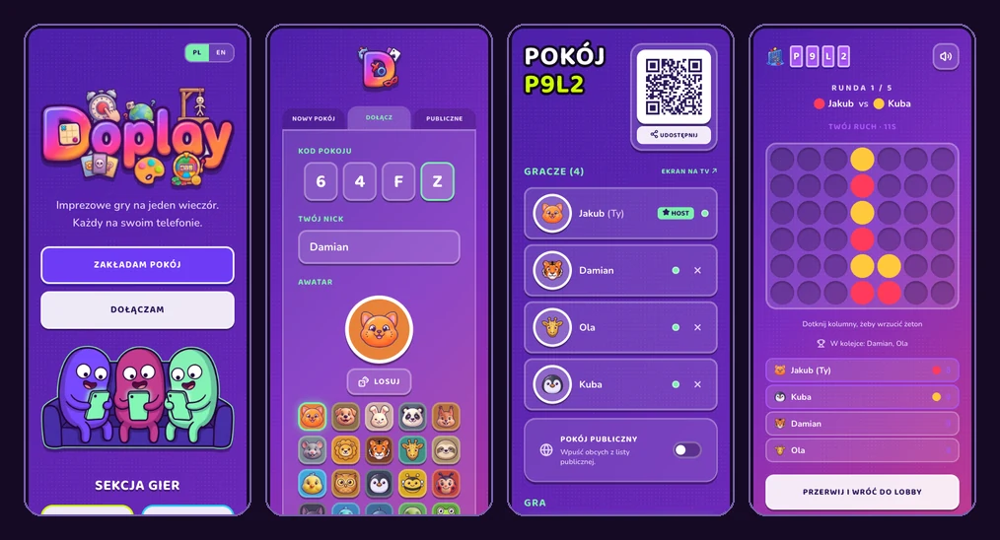
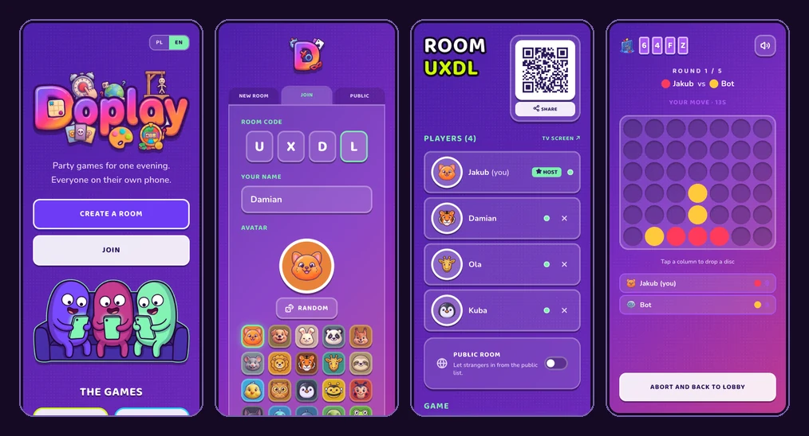
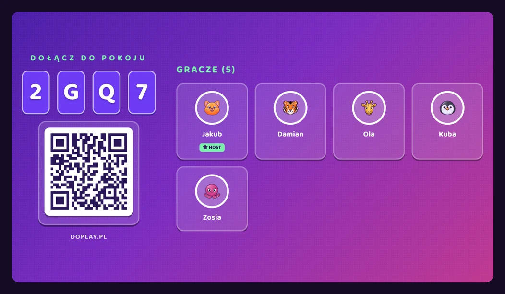

<p align="center">
  
</p>

<h1 align="center">Doplay</h1>

<p align="center">
  <b>English</b> · <a href="README.pl.md">Polski</a>
</p>

<p align="center">
  Multiplayer party games in the browser. Everyone on their own phone, one shared room.
  <br />
  <a href="https://doplay.pl"><strong>🔗 doplay.pl</strong></a>
</p>

<p align="center">
  
  
  
  
  
  
  
  
  
</p>

---

> **Note:** the app ships in **Polish and English** — there's a switcher in the corner.
> Both are complete: the shell, every in-game screen, the host screen and the rules cards.
> Directory and route names stay Polish throughout, because that's the app's home language,
> and so does the game *content* — the word lists for Hangman and Categories are Polish,
> and so is the Hangman keyboard, since the phrases it spells are.

## About

**Doplay** is a set of multiplayer party games you play in a single sitting — everyone on their own phone. No accounts, no downloads, no explaining the rules. One person creates a room, everyone else types a 4-character code, and **you're playing in 15 seconds**.

### How it works

1. 🏠 **Host creates a room** — gets a 4-letter code + QR
2. 📱 **Players join** — type the code on their phone (or scan the QR)
3. 🎮 **Host picks a game** — settings, start, play!
4. 🔄 **Next round** — when it ends you're back in the lobby to pick another

## Screenshots

Four screens — landing, joining, lobby, and a round in progress — in both languages.
The interface switches whole: nothing is left half-translated.

**Polski**



**English**



### Host screen (TV)

A separate landscape layout for a laptop or TV — huge room code, QR to scan, and who's already in.
Open it from the lobby; players keep their own phones.



## Games

| Game | Description | Players |
|---|---|---|
| **Stopwatch** | Stop at the perfect moment. Without looking at the digits. 2 modes: **TARGET** and **GUESS THE TIME**. | 1–16 |
| **Categories** | A letter drops, pens start moving. First one done wins. | 1–16 |
| **Hangman** | Guess the phrase before the figure hangs. 3 modes: race, co-op, setter. | 1–16 |
| **Impostor** | Everyone knows the password. Almost everyone. Find the mole or lose. | 3–16 |
| **Mafia** | The town sleeps. The Mafia doesn't. Auto-narrator, roles: detective, doctor, mafia. | 4–16 |
| **Shade** | Memorise the colour. Rebuild it from memory with three sliders. | 1–16 |
| **Casino** | Bet your chips. Run out and you're out. 4 modes: Jackpot, Double, Wheel, Slots. | 2–16 |
| **Tic-tac-toe** | Three in a row. The winner keeps the table, the rest queue up to take it. | 2–16 |

> **Stopwatch has two modes.** In **TARGET**, everyone gets the same time to hit and stops the
> clock on their own device — the digits are masked, so you count in your head. In **GUESS THE
> TIME**, one player is the Runner (rotating each round): they start and stop whenever they want,
> and **nobody sees the digits — not even them**. START and STOP are broadcast as sound to every
> phone, so the rest estimate by ear and type in their guess.

> **The Stopwatch also trains alone.** A separate page, no room required: set your own target,
> and after a few attempts you get the error on each one, the spread, your current streak and a
> read on the thing that actually costs you points — whether you are consistently early or late,
> which is a habit you can correct, or simply erratic, which you can't.

## Features

### Room and lobby
- **4-character room code** — chunky letters, click to copy
- **QR code** — scan from a phone, no typing
- **Deep link** — `doplay.pl/?kod=XYZW` goes straight into the room
- **Sharing** — Share button (native share / clipboard fallback)
- **Host screen (TV)** — separate landscape layout for a laptop/TV, readable from the couch
- **Avatars** — 30 illustrated icons on colored tiles; no two people in a room get the same one
- **Spectator mode** — `?widz=1` gets you into the room to watch without taking a seat, in any game
- **Game rules** — modal with steps for each game
- **Room records** — who won how many times plus a list of feats, persistent for the room's lifetime
- **Empty slots** — the lobby shows free seats, so a host waiting alone isn't staring at one row and a void
- **Folder tabs** — creating and joining are two tabs of one form; nickname and avatar survive the switch

### Realtime multiplayer
- **Anonymous auth** — Firebase Anonymous Auth, zero sign-up
- **Presence** — green/grey dot showing who's online
- **Reconnect** — return to the room after a refresh or close (localStorage)
- **Host migration** — if the host disappears for >30s, another player takes over
- **Idempotency** — actionId (UUID) prevents duplicate actions
- **Connection bar** — red "no connection", green "connected"
- **Exponential backoff** — 500ms → 1s → 2s → … → 16s max

### Language
- **Polish and English** — a switcher in the corner, no language prefix in the URL (room codes live there); covers every screen, including the games and the TV layout
- **Cookie-based** — the server reads it before the first render, so nothing flashes in the wrong language
- **Link card** — `og:image` plus a title and description in the reader's language, because the room link gets pasted into group chats

### Security
- **The client NEVER writes game state** — every write goes through Route Handlers + `firebase-admin`
- **Roles and passwords are secret** — they live in `rooms/{code}/secret/state` (Firestore: `allow read: if false`)
- **Per-player private data** — `rooms/{code}/private/{uid}` (yours only)
- **No leaks in DevTools** — Mafia roles and the Impostor password are invisible client-side

### PWA and mobile
- **Installable** — manifest + Service Worker (Serwist), install prompt, iOS hint
- **Offline** — dedicated offline page, NetworkOnly for the API and Firebase
- **Wake Lock** — the screen doesn't dim mid-game
- **Vibration** — haptic feedback on actions (with an opt-out)
- **Visual Viewport** — `--vvh` for mobile keyboards
- **Safe areas** — `env(safe-area-inset-*)` for notch/dynamic island

### Look and UX
- **"Arcade Party" style** — purple-to-pink gradient, chunky buttons with hard shadows, sticker-like panels. Full spec in [`DESIGN.md`](DESIGN.md)
- **Button press** — the signature detail: every button sinks 4px when clicked
- **Animations** — slideIn, fadeIn, timer pulse, arcade-pop
- **SFX** — Web Audio: join, phase change, urgent tick, fanfare, defeat, neon buzz
- **Confetti** — canvas-confetti on a win, in the game's colors
- **Skeleton loader** — placeholder shaped like the lobby that's coming, so nothing jumps once it loads
- **Illustration set** — three recurring characters: on the landing page, waiting in an empty lobby, shrugging on error screens, celebrating on the podium
- **App frame** — the app is a rounded card set into a dark bezel, not a full-bleed page
- **prefers-reduced-motion** — fully respected

## Tech stack

| Layer | Technology |
|---|---|
| Framework | Next.js 15 (App Router) |
| UI | React 19, Tailwind CSS v4 |
| Language | TypeScript (strict, zero `any`) |
| Database | Cloud Firestore (realtime `onSnapshot`) |
| Auth | Firebase Anonymous Auth |
| Server | Route Handlers + `firebase-admin` |
| PWA | Serwist (Service Worker, manifest, offline) |
| Tests | Vitest (287 tests — full playthroughs, security, core contracts) |
| Deploy | Vercel (auto-deploy from GitHub) |
| Sound | Web Audio API (zero audio files) |
| QR | `qrcode` (SVG generation) |
| i18n | Own dictionary (~500 keys per language, no library — next-intl would force a language prefix in the URL) |
| Fonts | Baloo 2 (display), Nunito (body), JetBrains Mono (numbers) |
| Icons | Lucide (interface) + a custom illustration pack (30 avatars, 8 game icons, characters) |
| Image pipeline | `scripts/process-assets.py` — Pillow + NumPy, cuts the background off generated art |

## Architecture

Directory and route names are in Polish, matching the app's language — `nowy` = new,
`dolacz` = join, `pokoj` = room, `ekran` = screen.

```
src/
├── app/                        # Next.js App Router
│   ├── layout.tsx              # root layout, fonts, PWA, ConnectionBar
│   ├── page.tsx                # landing page + deep link /?kod=
│   ├── nowy/                   # create a room
│   ├── dolacz/                 # join a room
│   ├── pokoj/[code]/           # player screen (lobby + game)
│   │   └── ekran/              # host screen for TV (landscape layout)
│   ├── p/[code]/               # deep link from the QR (code pre-filled)
│   ├── gry/stoper/trening/     # solo Stopwatch practice (no room needed)
│   ├── prywatnosc/             # privacy notice (GDPR art. 13)
│   ├── opengraph-image.jpg     # link card for chats and social
│   ├── ~offline/               # offline page (PWA)
│   ├── robots.ts               # robots.txt (rooms stay out of the index)
│   ├── sitemap.ts              # sitemap.xml
│   └── api/                    # Route Handlers (the ONLY place that writes!)
│       ├── cron/cleanup/       # nightly: expired rooms + orphan sweep
│       └── rooms/
│           ├── route.ts        # POST — create room
│           └── [code]/
│               ├── join/       # joining
│               ├── leave/      # leaving
│               ├── ping/       # presence + host migration
│               ├── start/      # start the game
│               ├── action/     # player action (idempotent)
│               ├── tick/       # phase tick (timer)
│               ├── reset/      # back to lobby (transaction)
│               └── observe/    # observer mode (host screen)
│
├── games/                      # Game engines and UI (plugin architecture)
│   ├── registry.ts             # engine registry (server)
│   ├── manifests.ts            # game manifests (client — without engines)
│   ├── icons.tsx               # fallback game icons (Lucide)
│   ├── rules.ts                # "How to play?" cards — PL and EN separately
│   ├── finish.test.ts          # "end game" contract across the whole registry
│   ├── components.tsx          # game UI (dynamic imports)
│   ├── types.ts                # GameEngine, GameManifest interfaces
│   ├── view.ts                 # GameViewProps interfaces
│   ├── stoper/                 # ⏱️ Stopwatch
│   │   ├── engine.ts           # pure function: init → action → state
│   │   ├── manifest.ts         # metadata + settings schema (Zod)
│   │   ├── Settings.tsx        # settings panel
│   │   ├── PlayerView.tsx      # player view
│   │   └── HostView.tsx        # TV view
│   ├── panstwa-miasta/         # ✍️ Categories
│   ├── wisielec/               # 🪢 Hangman
│   ├── impostor/               # 🕵️ Impostor
│   ├── mafia/                  # 🔪 Mafia
│   ├── odcien/                 # 🎨 Shade
│   ├── kasyno/                 # 🎰 Casino
│   └── kolko/                  # ⭕ Tic-tac-toe
│
├── components/                 # React components
│   ├── game/                   # GameShell, LobbyGames, GameRulesCard
│   ├── AvatarIcon.tsx          # avatar illustration + tile color
│   ├── AvatarPicker.tsx        # grid of 30 avatars
│   ├── GameIcon.tsx            # game illustration (fallback: Lucide icon)
│   ├── GameCard.tsx            # game card on the landing page
│   ├── GameRow.tsx             # game row in the lobby
│   ├── SegmentPicker.tsx       # arcade segment buttons (game settings)
│   ├── HowToPlay.tsx           # "how to play" section on the landing page
│   ├── RoomRecords.tsx         # room records
│   ├── RoomCodeNeon.tsx        # chunky room code (click-to-copy)
│   ├── RoomQr.tsx              # room QR code
│   ├── PlayerList.tsx          # player list with presence
│   ├── ShareButton.tsx         # sharing (navigator.share)
│   ├── ConnectionBar.tsx       # online/offline bar
│   ├── InstallPrompt.tsx       # PWA install prompt
│   ├── ErrorBoundary.tsx       # error boundary per game
│   ├── LobbySkeleton.tsx       # skeleton loader
│   ├── Illustration.tsx        # illustration set (@1x/@2x via srcSet)
│   ├── ComingSoonCard.tsx      # "more games soon" tile
│   ├── EntryTabs.tsx           # folder tabs (create / join)
│   ├── LanguageSwitcher.tsx    # PL / EN
│   ├── PrivacyNotice.tsx       # first-visit notice (one bar at a time)
│   ├── ReturnToRoom.tsx        # "you have an active room"
│   ├── SpectatorRoom.tsx       # watching without taking a seat (reuses HostView)
│   └── WatchLink.tsx           # "watch" entry point
│
├── hooks/                      # Custom hooks
│   ├── useRoom.ts              # Firestore onSnapshot + backoff
│   ├── usePresence.ts          # ping every 10s (debounced)
│   ├── useServerClock.ts       # clock sync (NTP-like)
│   ├── usePrivate.ts           # private/{uid} listener
│   ├── useGameTick.ts          # auto-tick when a phase expires
│   ├── useAnonAuth.ts          # Firebase Anonymous Auth
│   ├── useWakeLock.ts          # Screen Wake Lock API
│   ├── useVibrate.ts           # Vibration API (with opt-out)
│   └── useVisualViewport.ts    # Visual Viewport API (--vvh)
│
├── lib/                        # Infrastructure
│   ├── server/game-runner.ts   # applyAction, persist, idempotency
│   ├── server/records.ts       # room records (pure functions, testable)
│   ├── server/cleanup.ts       # which room to delete (pure, testable)
│   ├── trening-stats.ts        # Stopwatch practice stats (pure)
│   ├── site.ts                 # canonical address for SEO
│   ├── client/api.ts           # apiPost with error handling
│   ├── sound.ts                # Web Audio SFX (10 sounds)
│   ├── confetti.ts             # canvas-confetti wrapper
│   ├── action-id.ts            # crypto.randomUUID()
│   ├── client/notices.ts       # coordinates the bars pinned to the bottom
│   ├── i18n/                   # dictionary, provider, privacy copy
│   ├── store/session.ts        # Zustand (activeRoom)
│   └── types/room.ts           # Room, Player, RoomStatus
│
└── sw.ts                       # Service Worker (Serwist)
```

### Key design decisions

- **Read-only client** — the client NEVER writes to Firestore. Everything goes through Route Handlers + `firebase-admin`. Breaking this rule leaks roles in DevTools.
- **Engines are pure functions** — zero `Date.now()`, zero `Math.random()`. Time and randomness arrive via `ctx.now` and `ctx.rng`. Fully deterministic, fully testable.
- **Plugin architecture** — adding a game = a new folder in `src/games/` plus an entry in **six registries** (engine, client manifest, views, icon, rules card, dictionary). Zero changes to the core. The six are worth naming, because missing one **doesn't break the build**: the game just quietly stops working in one place, which is far harder to spot than a red build. Verified while adding Tic-tac-toe — the contract tests passed straight away, without touching `GameShell` or `game-runner`.
- **Dynamic imports** — game components load on demand (`next/dynamic`). A player downloads only the current game's code, not all eight.
- **Secrets in three layers** — `publicState` (everyone sees), `secret/state` (nobody reads, `allow read: if false`), `private/{uid}` (yours only).
- **Timers without cron** — the server writes `phaseEndsAt`, clients count down, and once it passes **only the host** nudges the server. The rest step in as a fallback after 3s, in case the host drops. Previously everyone nudged at once, which with 8 players meant ~6.6 transactions/s against a single document versus Firestore's ~1/s limit — transactions collided, retried, and phase changes ran several seconds late.
- **Deleting a room always means `recursiveDelete`** — a plain `delete()` on a Firestore document leaves its subcollections behind, and `secret/state` and `private/{uid}` are exactly where the roles live. The room would vanish from the list while every player's role stayed in the database, parentless and invisible in the console. Firestore's own TTL policies are out for the same reason: they only delete the parent. Hence a nightly cron of our own, which also sweeps orphans as a second line of defence. The sweeper's hard part isn't deleting — it's the race: a room created *after* the cron read the room list has no parent on that list, though it is very much alive. So the cutoff is the query's `readTime`, not an age threshold, and both timestamps come from Firestore's clock rather than the process's.
- **Polish first, English alongside** — code, routes and directory names stay Polish; the interface reads from a dictionary. No i18n library: next-intl would force a language prefix into the URL, and room codes live there. The language sits in a cookie the server reads before the first render, so nothing flashes in the wrong language.
- **Fonts with `latin-ext`** (Ą Ć Ę Ł Ń Ó Ś Ź Ż) — having the glyphs isn't enough though: Fredoka has them, but draws the ogonek in Ą/Ę as a thin hairline detached from the letter. Hence Baloo 2 — details in [`DESIGN.md`](DESIGN.md).
- **Component rules live in `@layer components`** — Tailwind orders the cascade theme → base → components → utilities. Outside a layer these rules land *after* the utilities and win every tie, so `px-4` next to `.card` silently did nothing. About forty such spots existed before the fix.
- **The core knows no game** — two features work through engine opt-in rather than core knowledge. A game without the opt-in simply works, just without that feature:
  - **Records** — an engine tags its event with `meta: { uid, rekord: true }`; the core collects it into the room's feats.
  - **Ending a game** — an engine exposes `canFinish` in `publicView`, and `GameShell` then shows "End game" instead of the emergency abort. Ending gives you a podium and saves records; aborting doesn't.

## Running locally

### Requirements

- Node.js 22+
- A Firebase project with Firestore and Authentication (Anonymous)

### Install

```bash
git clone https://github.com/w84kubus/doplay.git
cd doplay
npm install
```

### Configuration

Create a `.env.local` file:

```env
NEXT_PUBLIC_FIREBASE_API_KEY=your_api_key
NEXT_PUBLIC_FIREBASE_AUTH_DOMAIN=your_project.firebaseapp.com
NEXT_PUBLIC_FIREBASE_PROJECT_ID=your_project_id
NEXT_PUBLIC_FIREBASE_STORAGE_BUCKET=your_project.firebasestorage.app
NEXT_PUBLIC_FIREBASE_MESSAGING_SENDER_ID=your_sender_id
NEXT_PUBLIC_FIREBASE_APP_ID=your_app_id

# firebase-admin (Route Handlers) — the whole service account JSON, base64-encoded:
#   base64 -i path/to/key.json | tr -d '\n'
FIREBASE_SERVICE_ACCOUNT_KEY=your_base64_encoded_service_account_json

# Secret for the nightly cleanup cron. Generate with: openssl rand -hex 32
# Without it /api/cron/cleanup answers 401 and nothing is deleted.
CRON_SECRET=your_random_secret
```

See [`.env.local.example`](.env.local.example) for the same list with comments.

### Commands

```bash
npm run dev        # dev server (localhost:3000)
npm run build      # production build
npm run lint       # eslint
npm run test       # vitest run (287 tests)
```

## Installing on a phone (PWA)

The app is fully installable as a PWA:

| Platform | How |
|---|---|
| **iOS** | Safari → Share (↑) → *Add to Home Screen* |
| **Android** | Chrome → Menu (⋮) → *Install app* / automatic prompt |

Once installed it runs full-screen with its own icon. The host screen (TV) stays awake thanks to Wake Lock.

## License

**All rights reserved** — see [LICENSE](LICENSE).

The source is public **for reference only**: to be read, studied and reviewed.
This is not open source. Copying, reusing it in another project or running it as
your own service requires written permission. The name, domain, logo and
illustrations are not covered even by that limited publication.
